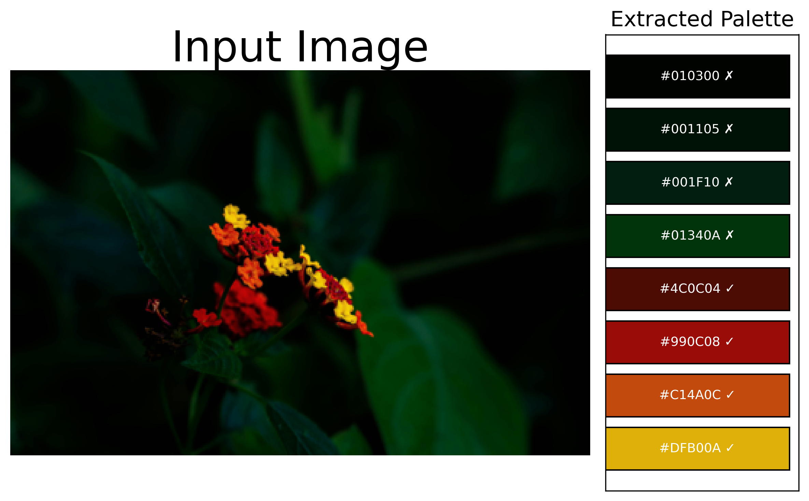

# ColorBlindSafe Figure Palette 

**Automatically extract color palettes from images and scientific figures — and verify if they are color-blind safe.**

While existing tools extract palettes (eg Pylette), they do not consider color blindness issues. Colors that appear distinct to one viewer may be indistinguishable to others, especially in scientific figures where colors are crucial in understanding figures.

This project goes beyond palette extraction by simulating color-blind vision and evaluating perceptual color separation. Each color is classified as safe or unsafe based on whether it remains distinguishable under common color-vision deficiencies.

Here , such gap is filled. Researchers can now worry less about deciding on which colors to use, but also effectively reproduce any figure easily. 

---

## Features

- Extract dominant colors from images or figures
- Compute color usage frequency
- Simulate color-blind vision:
  - Protanopia (red-blind)
  - Deuteranopia (green-blind)
  - Tritanopia (blue-blind)
- Quantify perceptual color separation (ΔE)
- Automatically label colors as **safe / unsafe**
- Generate:
  - Publication-ready palette figure
  - Human-readable `.txt` summary
- Designed for **scientific plots, papers, and presentations**

---

## Example Output

<p align="center">
  
</p>

---

##  Video Walkthrough

A full explanation of the theory and code is available here:
 https://youtu.be/-E_L7enoNu0

---

## Usage

```python

extract_colorblind_safe_palette(
    "data/flower.jpg",
    n_colors=8
)
```

